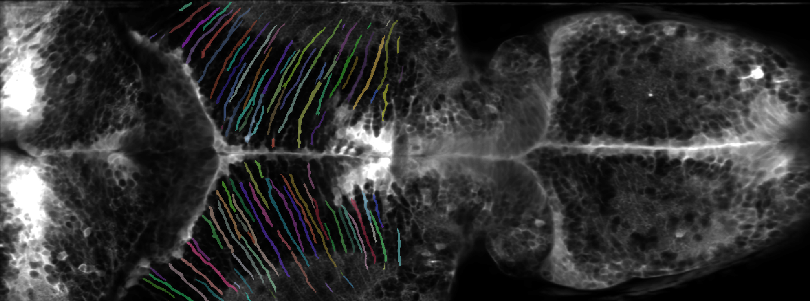

# Astro-glial Cell Segmentation

## Overview
This document details the process of astro-glial cell segmentation using a mean image from a motion-corrected movie in Suite2p. The segmentation process employs custom-trained Cellpose models, each targeting specific parts of astroglial cells. By combining multiple Cellpose models, we achieve optimal segmentation, which is subsequently used for data processing and trace extraction with Suite2p.

## Mean Image from Suite2p
The mean image from Suite2p, represented as a numpy array, is fed into the Cellpose models for mask prediction.

## Cellpose Models
Three distinct Cellpose models were trained on different parts of astroglial cells:

1. **Model 1 (CP2_s1_039189)**: Trained on cells with well-defined bodies and processes (referred to as seed 1).
2. **Model 2 (CP2_s2_039234)**: Trained on all cellbodies (referred to as seed 2).
3. **Model 3 (CP2_s3_039234)**: Trained on processes or orphaned processes (referred to as seed 3).

## Seed Sets
The seed sets comprise the same set of nine mean images, each with different mask overlays corresponding to different parts of the cells as described above.

## Augmentation of Seed Sets
During the training phase, we used a straightforward augmentation technique for the seed images, creating approximately 20-fold copies of the seed images, resulting in around 200 training images. While this simple augmentation approach poses overfitting issues, the models still performed satisfactorily. They were tested on at least one unseen test image and produced good results. This approach significantly reduced the amount of work required.

## Training Cellpose Models
The models were trained within Cellpose 2 with the following parameters:

### Model 1
- **Learning rate**: 0.1
- **Weight decay**: 0.0001
- **Epochs**: 900
- **Training images**: 189

### Model 2
- **Learning rate**: 0.1
- **Weight decay**: 0.0001
- **Epochs**: 900
- **Training images**: 234

### Model 3
- **Learning rate**: 0.1
- **Weight decay**: 0.0001
- **Epochs**: 900
- **Training images**: 234

## Results from the Different Models
The results of each model were evaluated through visual inspection of the predicted masks on test images.

### Model 1
- Successfully masked most well-defined cell bodies with processes, but many fragmented process masks were observed, with few complete process masks.

### Model 2
- Efficiently masked most cell bodies, with very few incomplete masks. This model was particularly effective in masking cell bodies not covered by Model 1, focusing on cells that only have cell bodies.

### Model 3
- Excelled in masking processes, though some fragmented process masks were observed due to overlapping processes. This issue stems from the training images, where unclear process ownership resulted in individual cell masks. Users are advised to inspect and manually correct such masks.

## Combining the Models
The motivation behind combining the models is from poor performance of a single model in masking a complicated cell structure such as astroglial cells. Cellpose does it better in only masking simple cell structures, such as simple round cells.
Cells within our dataset are complicated, there are cells that have well-defined cell bodies with processes, cells that have only cell bodies, and orphaned processes. 
Instead of training a single general model, we opted for an ensemble of models to leverage the unique strengths of each individual model. This approach allows for more precise segmentation, as different models excel in identifying specific features of astroglial cells. The combined model offers the best overall performance:

- **Model 1**: Provides the base mask.
- **Model 3**: Extends and connects fragmented processes in the base mask.
- **Model 2**: Masks cell bodies not covered by Model 1.

## Data Processing and Trace Extraction with Suite2p
The combined mask is used for data processing and trace extraction within Suite2p. 

## Further Work
Each Cellpose model can be improved with more seed images and better augmentation techniques. The models can also be trained on more diverse datasets to improve their generalization capabilities.
